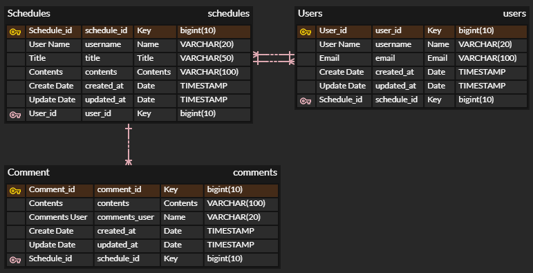

# API 명세서
기능| Method |             URL              | request  |response
:---:|:------:|:----------------------------:|:--------:|:---:
일정 저장|  POST  |        /api/schedules        | 요청 body  |작성 정보
일정 단건 조회| GET |        /api/schedules        | 요청 param |일정 정보
일정 수정|  PUT   | /api/scheduls/{schedule_id} | 요청 body  |수정 정보
댓글 저장|  POST  | /api/comments/{schedule_id}  | 요청 body  |작성 정보
댓글 모두 조회|  GET   |        /api/comments         | 요청 param |댓글 정보
댓글 단건 조회|  GET   |        /api/comments         | 요청 param |댓글 정보
댓글 수정|  PUT   | /api/comments/{comments_id}  | 요청 body  |수정 정보
댓글 삭제| DELETE | /api/comments/{comments_id}  | 요청 param |

# ERD
